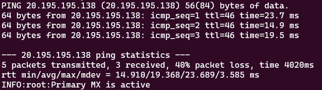
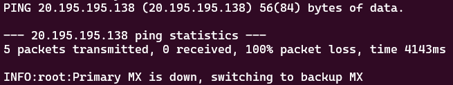

# Meraki VPN Failover Automation
The Meraki VPN Failover Automation Project aims to ensure high availability and continuous connectivity for network branches by automatically switching to a backup MX when the primary MX fails in a VPN concentrator environment.
The project uses a Python script that constantly monitors the availability of the primary MX by pinging its public IP address. If the primary MX becomes unreachable, the script automatically configures the network branches to use the backup MX as their VPN hub. When the primary MX becomes available again, the script switches the branches back to using the primary MX.

## Setup
The project involves three types of network devices: VPN concentrator hub with primary and backup MX, and multiple network branches. The primary MX is the default VPN hub for the branches. If the primary MX fails, the branches switch to using the backup MX as their VPN hub.
The specific details of these devices, including their serial numbers, network IDs, and the public IP address of the primary MX, are defined in the Python script.
The script uses the Meraki Dashboard API to interact with these devices. The API key and organization ID for the API are also defined in the script.

1. Clone this repository

        $ git clone [add_link_to_repository_here]

2. Substitute the key values inside the hub_failover.py file

3. Make sure to have python3 installed

        $ sudo apt-get install python3

4. Run it

        $ python3 hub_failover.py

*If Primary is up:

* If Primary is down:

## Python Script
The Python script contains two main functions: is_host_reachable, which checks if the primary MX is reachable by pinging its public IP address, and set_vpn_config, which sets the VPN configuration for a network.
In the main loop, the script continuously checks if the primary MX is reachable. If it's not, the script sets the VPN configuration for each branch to use the backup MX as their VPN hub. If the primary MX is reachable, the script sets the VPN configuration for each branch to use the primary MX as their VPN hub.
The script uses the Python requests library to make API requests and the Python logging library to log information and error messages. It also uses the Python os library to execute the ping command.
The script is designed to run indefinitely and check the status of the primary MX every 20 seconds.

## Team Members
* Caio Scarpa - SE | cscarpa@cisco.com
* Lucas Pavanelli - SE | lpavanel@cisco.com
* Leonardo Sambrana - TSA | lsambran@cisco.com
